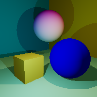

Ctrace
==============

A simple C++14 contexpr based compile-time raytacer. This is just an abuse of the flexibility that the C++ compilers offer, it is not suitable for serious use.

A sample image:

Dependencies:
-------------
* C++14 compiler (the makefile uses clang++ (3.4+), but g++ is fine too).
* Magick++ (libmagick++-dev).

How to build (Linux):
---------------------
* make -j4
* ./a.out

Performace (using the sample scene, on a core-i7):
-----------
* 20*20 image:
  * compile-time: 3.8 sec
  * run-time: 0.085s
* 200*200 image:
  * compile-time: 284.2 sec
  * run-time: 0.125s

Settings
-------------
* You can set the image size in `src/scene_settings.hpp`
* You can modify the scene in `src/scene_setup.hpp`

----------------------
If you have any problem, please post in the issues tab or mail me at icyplusplus@gmail.com. Any feedback would be appreciated.
